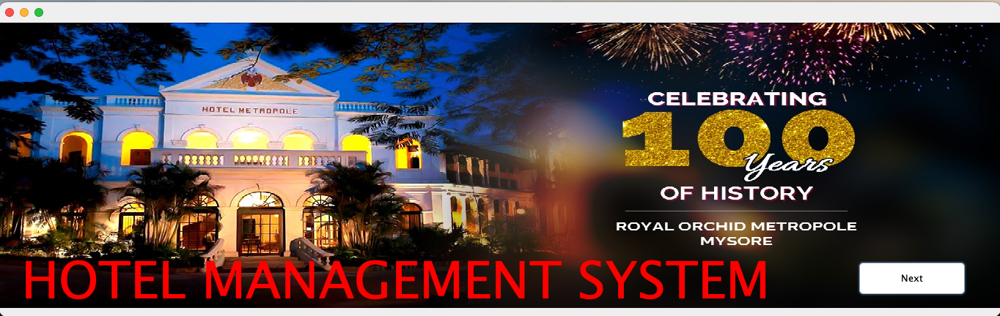
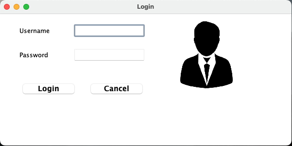

# Project Title:

Hotel Management System

## 1. Project Description:

Hotel Management System is a desktop-based application that allows a
hotel manager to handle all hotel activities e.g. manage various rooms,
employee, drivers and customers.


## 2. Tech Stack:

- Java 11

- MySQL

## 3. Project Dependencies:

- mysql-connector-java-8.0.27.jar
  
- rs2xml.jar

## 4. Installation:

i. Clone the git repo

```
https://github.com/AAdewunmi/Hotel-Management-System.git
```

ii. Open project folder

iii. Explore

😎

## 5. How To Use:

i. Create Database and Tables (src/hotel/mysql_command.txt)

ii. Run MySQL Server

iii. Run HotelManagementSystem.java

iv. Click next

v. Log in 

- User Name: admin

- Password: 12345

```

NB: Make sure dependencies are installed for the project.
```

## 6. Demo

- Landing Page:



- Login Page:



- Hotel Management System Dashboard:


## 7. Contributing:

Pull requests are welcome. For major changes, please open an issue first to discuss what you would like to change.


## 8. Adapted From: 

UDEMY: 45 Real World Java Development Projects Bootcamp Course 2022

Java Programming Course: Learn Development Of JAVA Projects Using JSP,JDBC, Servlets, Swing, Spring Boot, Maven, Hibernate

Project Name: Project 2: Hotel Management System

Created by: Engineering.Org.In

Last updated: 09/2022

URL: https://www.udemy.com/course/java-programming-project-using-jsp-jdbc-servlets/


